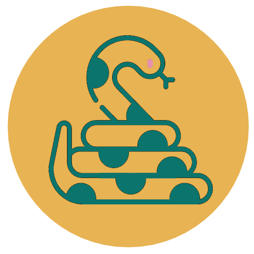

# Udav

Udav repository has [Ukrainian :ukraine:](#мова-програмування-удав-ukraine) and [English :uk:](#programming-language-udav-uk) localizations

# Мова програмування Удав :ukraine:

<p align='center'>
  
</p>

**_Мова програмування Удав_** - це жартівлива мова програмування, створена на основі Python. Ідея виникла, коли мій друг, не програміст, назвав Python "Удавом". З тих пір у нас в компанії ходив прикол про "Удава".

Коли я вирішив створити щось більш менш серйозне, я вирішив провести маленьку підготовку та випробування своїх знань, написавши мову програмування Удав. Я намагався не напружуватися і просто отримати задоволення від процесу створення, оскільки це все ще лишається жартом.

За основу я взяв синтаксис Python перекладений на українську. Це означає, що код на Удав можна відтворити багато разів, оскільки він автоматично перекладається на Python. Крім того, Удав підтримує усі python модулі.

**_Як ви вже зрозуміли мова програмування називається Удав, тож логічно буде, якщо код цією мовою писався з застосуванням snake_case_**

**_Швидкий перехід між розділами:_**

- [Udav](#udav)
- [Мова програмування Удав :ukraine:](#мова-програмування-удав-ukraine)
  - [Мова програмування Удав](#мова-програмування-удав)
    - [Інсталяція](#інсталяція)
      - [Компіляція](#компіляція)
      - [Ініціалізація](#ініціалізація)
      - [Деніціалізація](#деніціалізація)
    - [Синтаксис](#синтаксис)
  - [Корисні посилання](#корисні-посилання)
- [Programming language Udav :uk:](#programming-language-udav-uk)
  - [Programming language Udav](#programming-language-udav)
    - [Installation](#installation)
      - [Compiling](#compiling)
      - [Initialization](#initialization)
      - [Denialization](#denialization)
    - [Syntax](#syntax)
  - [Useful links](#useful-links)

---

## Мова програмування Удав

### Інсталяція

Цей розділ надасть вам інструкції, щодо встановлення, ініціалізації та деініціалізації компілятора Удав.

#### Компіляція

Щоб запустити компілятор Удава, вам необхідно буде виконати наступні дії:

1. Клонуйте репозиторій з GitHub:

```bash
git clone https://github.com/NikitaBerezhnyj/Udav.git
```

2. Перейдіть в теку з проектом:

```bash
cd Udav/'Programming Language'/src
```

3. Відкомпілюйте C++ файл:

```bash
g++ compiler.cpp -o udav
```

Після завершення компіляції в теці з проектом буде створений виконуваний файл udav. Після ініціалізації цей файл можна буде використовувати для запуску програм мовою Удав з будь-якої теки.

#### Ініціалізація

Ініціалізація компілятора Удав необхідна для того, щоб можна було використовувати його з будь-якої теки на вашому комп'ютері. Для цього виконайте наступну команду:

```bash
./udav -i
```

або

```bash
./udav --init
```

Після ініціалізації компілятора файл udav буде скопійовано в теку з іншими утилітами, що дасть можливість використовувати його для запуску програм мовою Удав з будь-якої теки.

#### Деніціалізація

Деініціалізація компілятора Удав необхідна, якщо ви більше не плануєте використовувати його. Для цього виконайте наступну команду:

```bash
./udav --u
```

або

```bash
./udav --uninit
```

Це видалить Удав з теки з утилітами, але залишить його у теці з проєктом, тому ви зможете використовувати його і потім, якщо забажаєте

### Синтаксис

Синтаксис Удав є перекладом мови Python на українську, для більшої простоти навчання та програмування українських розробників, тому синтаксиси цих двох мов майже не відрізняються.

**_Створення коментарів_**

```python
# Це коментар, його компілятор не бачить
```

**_Вивід тексту на екран_**

```python
# Вивід звичайного тексту
друк("Привіт, Світ!")

# Вивід змінної
а = 10
друк(а)
```

**_Оголошення змінних_**

```python
# Цілочисельна змінна
інт = 10

# Дійсна змінна
флоат = 10.5

# Рядкова змінна
стрінг = "Рядок"

# Булева змінна
бул = правда

```

**_Ввід користувача_**

```python
# Записується рядок
рядок_вводу = ввід()

# Записується ціле число
число_вводу = ціле(ввід())

# Записується ціле число
дріб_вводу = дійсне(ввід())
```

**_Оголошення масивів_**

```python
# Оголошення масиву цілих чисел
цілий_масив = [0, 1]

# Оголошення масиву дійсних чисел
дробовий_масив = [0.5, 1.001]

# Оголошення масиву рядків
рядковий_масив = ["привіт", "світ"]

# Оголошення масиву булевих виразів
булевий_масив = [правда, правда, брехня]

```

**_Умови if (якщо), else if (інакшеЯкщо) та else (інакше)_**

```python
# Умова якщо
якщо а < 5:
    друк("<5")

# Умова якщо-інакше
якщо а < 5:
    друк("<5")
інакше:
    друк(">8")

# Умова якщо-інакшеЯкщо-інакше
якщо а < 5:
    друк("<5")
інакшеЯкщо а > 5 та а < 8:
    друк("<5 and >8")
інакше:
    друк(">8")
```

**_Оголошення циклу while (поки)_**

```python
# Приклад циклу while (поки)
лічильник = 0
поки лічильник < 10:
    лічильник += 1
    друк(лічильник)
```

**_Оголошення циклу for (для)_**

```python
# Приклад циклу for (для)
для л до діапазон(10):
    друк("Привіт, Світ!")
```

**_Оголошення функції_**

```python
# Приклад функції
функція Привіт_світ():
	рази = ціле(ввід("Введіть кількість повторів: "))
	друк(рази)
	для i до діапазон(рази):
		друк("Привіт, Світ!")
```

**_Робота з сторонніми модулями_**

```python
# Приклад роботи з datetime
отримати datetime

поточна_година = datetime.datetime.now()
друк("Поточна дата та час: ", поточна_година)

# Приклад роботи з random
отримати random

число = random.randint(1, 100)
друк(число)
```

**_Приклад коду з стандартних конструкцій_**

```python
отримати random

функція Гра(кількість_спроб, випадкове_число):
    для спроба до діапазон(кількість_спроб):
        друк("Введіть будь ласка число від 1 до 10:")
        користувацьке_число = ціле(ввід("Введіть число: "))
        якщо користувацьке_число < випадкове_число:
            друк("Переможне число більше")
        інакшеЯкщо користувацьке_число > випадкове_число:
            друк("Переможне число менше")
        інакшеЯкщо користувацьке_число == випадкове_число:
            друк("Ви виграли!")
            повернути 0
        інакше:
            продовжити
    друк("Ви програли")
    друк(f"Переможне число: {випадкове_число}")

випадкове_число = random.randrange(1, 10)
кількість_спроб = ціле(ввід("Скільки ви хочете спроб:"))
Гра(кількість_спроб, випадкове_число)
```

**_Приклад коду в ООП парадигмі_**

```python
клас Тварина:
    функція __init__(своє , прізвисько, вік):
        своє.прізвисько = прізвисько
        своє.вік = вік

    функція Голос(своє):
        викинути ПомилкаВіртуальногоМетоду("Метод реалізується у підкласах")

клас Собака(Тварина):
    функція Голос(своє):
        повернути "Гав!"

клас Кіт(Тварина):
    функція Голос(своє):
        повернути "Няв!"


пес = Собака("Лорд", 3)
кішка = Кіт("Плюша", 2)

друк(пес.прізвисько + " каже:" + пес.Голос())
друк(кішка.прізвисько + " каже: " + кішка.Голос())
```

## Корисні посилання

**_Власне IDE:_** [https://github.com/NikitaBerezhnyj/NUB_IDE](https://github.com/NikitaBerezhnyj/NUB_IDE)

**_Розширення для VS code:_** [https://github.com/NikitaBerezhnyj/Udav_Language_Support_for_VS_Code](https://github.com/NikitaBerezhnyj/Udav_Language_Support_for_VS_Code)

**_Документація по проєкту:_** [https://nub-project-docs.netlify.app](https://nub-project-docs.netlify.app)

---

# Programming language Udav :uk:

<p align='center'>
  
</p>

**_Programming language Udav_** is a comic programming language based on Python. The idea came about when a non-programmer friend of mine called Python "Boa". Since then, we've had a joke about Boa in our company.

When I decided to create something more or less serious, I decided to do a little training and test my knowledge by writing a programming language called Boa. I tried to take it easy and just have fun with the process of creating it, since it was still a joke.

I took the Python syntax translated into Ukrainian as a basis. This means that the code in Udav can be reproduced many times because it is automatically translated into Python. In addition, Udav supports all python modules.

**_As you have already understood, the programming language is called Udav, so it would be logical if the code in this language was written using snake_case_**

**_Quick transition between sections:_**

- [Udav](#udav)
- [Мова програмування Удав :ukraine:](#мова-програмування-удав-ukraine)
  - [Мова програмування Удав](#мова-програмування-удав)
    - [Інсталяція](#інсталяція)
      - [Компіляція](#компіляція)
      - [Ініціалізація](#ініціалізація)
      - [Деніціалізація](#деніціалізація)
    - [Синтаксис](#синтаксис)
  - [Корисні посилання](#корисні-посилання)
- [Programming language Udav :uk:](#programming-language-udav-uk)
  - [Programming language Udav](#programming-language-udav)
    - [Installation](#installation)
      - [Compiling](#compiling)
      - [Initialization](#initialization)
      - [Denialization](#denialization)
    - [Syntax](#syntax)
  - [Useful links](#useful-links)

---

## Programming language Udav

### Installation

This section will provide you with instructions on how to install, initialize, and uninitialize the Udav compiler.

#### Compiling

To run the Udav compiler, you will need to perform the following steps:

1. Clone the repository from GitHub:

```bash
git clone https://github.com/NikitaBerezhnyj/Udav.git
```

2. Change to the project folder:

```bash
cd Udav/'Programming Language'/src
```

3. Compile the C++ file:

```bash
g++ compiler.cpp -o udav
```

After the compilation is completed, the udav executable file will be created in the project folder. After initialization, this file can be used to run Udav programs from any folder.

#### Initialization

Initialization of the Udav compiler is necessary in order to use it from any folder on your computer. To do this, run the following command:

```bash
./udav -i
```

or

```bash
./udav --init
```

After the compiler is initialized, the udav file will be copied to the folder with other utilities, which will make it possible to use it to run programs in Udav from any folder.

#### Denialization

You need to deinitialize the Udav compiler if you no longer plan to use it. To do this, run the following command:

```bash
./udav --u
```

or

```bash
./udav --uninit
```

This will remove Udav from the utilities folder, but leave it in the project folder, so you can use it later if you want to.

### Syntax

Syntax Udav is a translation of Python into Ukrainian, for ease of learning and programming for Ukrainian developers, so the syntaxes of these two languages are almost identical.

**_Creating comments_**

```python
# This is a comment, the compiler does not see it
```

**_Display text on the screen_**

```python
# print simple text
друк ("Привіт, Світ!")

# print a variable
а = 10
друк (а)
```

**_Declaration of variables_**

```python
# integer variable
інт = 10

# float variable
флоат = 10.5

# string variable
стрінг = "Рядок"

# boolean variable
бул = правда

```

**_User input_**

```python
# the string is written
рядок_вводу = ввід()

# an integer is written
число_вводу = ціле(ввід())

# A float is written
дріб_вводу = дійсне(ввід())
```

**_Declaration of arrays_**

```python
# Declaration of an array of integers
цілий_масив = [0, 1]

# Declaring an array of floats
дробовий_масив = [0.5, 1.001]

# Declaring an array of strings
рядковий_масив = ["привіт", "світ"]

# Declaring an array of booleans
булевий_масив = [ правда , правда , брехня ]

```

**_If, else if, and else conditions_**.

```python
# Condition if
якщо а < 5:
    друк ("<5")

# Condition if-else
якщо а < 5:
    друк ("<5")
інакше:
    друк(">8")

# Condition if-elif-else
якщо а < 5:
    друк ("<5")
інакшеЯкщо а > 5 та а < 8:
    друк ("<5 and >8")
інакше:
    друк (">8")
```

**_Declaring a while loop_**

```python
# An example of a while loop
лічильник = 0
поки лічильник < 10:
    лічильник += 1
    друк (лічильник)
```

**_Declaring a for loop_**

```python
# An example of a for loop
для л до діапазон(10):
    друк ("Привіт, Світ!")
```

**_Function declaration_**

```python
# An example of a function
функція Привіт_світ():
	рази = число (ввід("Введіть кількість повторів: "))
	друк(рази)
	для i до діапазон(рази):
		друк("Привіт, Світ!")
```

**_Working with third-party modules_**

```python
# An example of working with datetime
отримати datetime

поточна_година = datetime.datetime.now()
друк("Поточна дата та час:", поточна_година)

# An example of working with random
отримати random

число = random.randint(1, 100)
друк(число)
```

**_Example code from standard constructions_**

```python
отримати random

функція Гра(кількість_спроб, випадкове_число):
    для спроба до діапазон ( кількість_спроб ):
        друк("Введіть будь ласка число від 1 до 10:")
        користувацьке_число = ціле(ввід("Введіть число: "))
        якщо користувацьке_число < випадкове_число:
            друк("Переможне число більше")
        інакшеЯкщо користувацьке_число > випадкове_число:
            друк ("Переможне число менше")
        інакшеЯкщо користувацьке_число == випадкове_число:
            друк ("Ви виграли!")
            повернути 0
        інакше:
            продовжити
    друк ("Ви програли")
    друк (f"Переможне число: {випадкове_число}")

випадкове_число = random.randrange(1, 10)
кількість_спроб = число ( ввід ("Скільки ви хочете спроб:"))
Гра(кількість_спроб, випадкове_число)
```

**_A sample code in the OOP paradigm_**

```python
клас Тварина:
    функція __init__(своє , прізвисько, вік):
        своє.прізвисько = прізвисько
        своє.вік = вік

    функція Голос(своє):
        викинути ПомилкаВіртуальногоМетоду("Метод реалізується у підкласах")

клас Собака(Тварина):
    функція Голос(своє):
        повернути "Гав!"

клас Кіт(Тварина):
    функція Голос(своє):
        повернути "Няв!"


пес = Собака("Лорд", 3)
кішка = Кіт("Плюша", 2)

друк (пес.прізвисько + " каже:" + пес.Голос())
друк (кішка.прізвисько + " каже: " + кішка.Голос())
```

## Useful links

**_Custom IDE:_** [https://github.com/NikitaBerezhnyj/NUB_IDE](https://github.com/NikitaBerezhnyj/NUB_IDE)

**_Extensions for VS code:_** [https://github.com/NikitaBerezhnyj/Based_Language_Support_for_VS_Code](https://github.com/NikitaBerezhnyj/Based_Language_Support_for_VS_Code)

**_Project documentation:_** [https://nub-project-docs.netlify.app](https://nub-project-docs.netlify.app)
